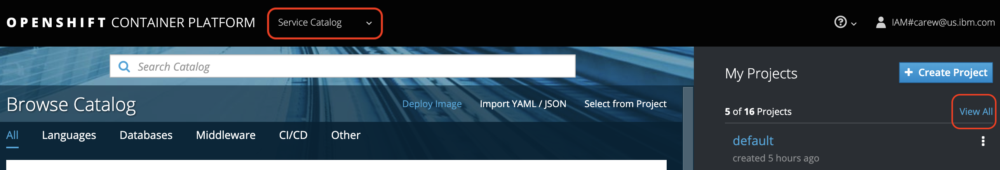
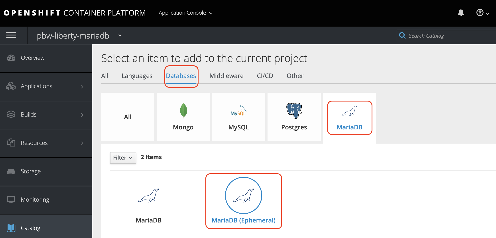
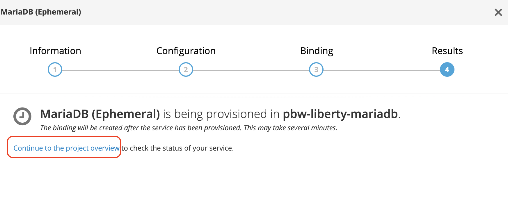
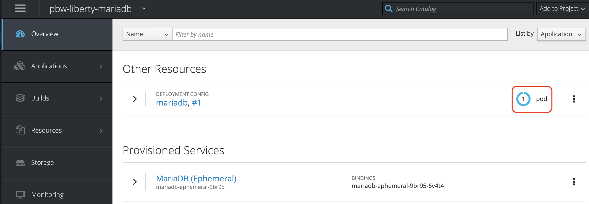
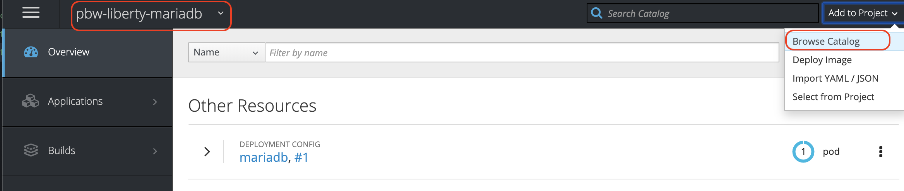
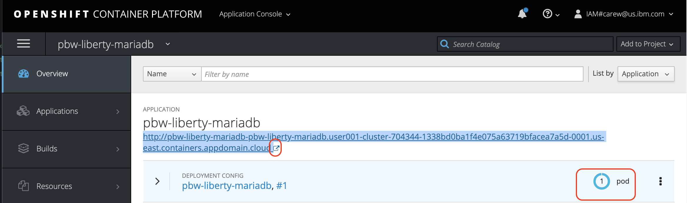

# IBM Client Developer Advocacy App Modernization Series

## Lab - Migrating Legacy JEE apps to OpenShift on the IBM Cloud Kubernetes Service

### Working with S2I and Templates

## Overview

S2I in a tool deployed in OpenShift that provides a repeatable method to generate application images from source/binary code Templates provide a parameterized set of objects that can be processed by OpenShift. Templates provide a parameterized set of objects that can be processed by OpenShift.

In this lab you'll use these  capabilities can be used to deploy a small legacy  Java EE app to OpenShift on the IBM Cloud Kubernetes Service.

### Step 1: Logon into the OpenShift Web Console and to the OpenShift CLI

1.1 Go to your IBM Cloud resource list https://cloud.ibm.com/resources

1.2 Click on  your designated OpenShift cluster

   

1.3 Click on **OpenShift web console**

   

1.4 From the OpenShift web console click on your username in the upper right and select **Copy Login Command**

   

1.5 Paste the login command in a terminal window and run it (Note: leave the web console browser tab open as you'll need it later on in the lab)

### Step 2: Clone the WebSphere Liberty S2I image source, create a Docker image,  and push it to the OpenShift internal registry

2.1 Clone the  the WebSphere Liberty S2I image source by issuing the following commands in the terminal window you just used to login via the CLI

   ```bash
   git clone https://github.com/IBMAppModernization/s2i-liberty-javaee7.git
   cd s2i-liberty-javaee7
   ```

2.2 Get the hostname of your OpenShift internal registry so you can push images to it

   ```bash
   export INTERNAL_REG_HOST=`oc get route docker-registry --template='{{ .spec.host }}' -n default`
   ```
2.3 Create a new OpenShift project for this lab

   ```bash
   oc new-project pbw-liberty-mariadb
   ```

2.4 Build the S2I Liberty image and tag it appropriately for the internal registry

   ```bash
   docker build -t $INTERNAL_REG_HOST/pbw-liberty-mariadb/s2i-liberty-javaee7:1.0 .
   ```

2.5 Login to the internal registry

   ```bash
   docker login -u `oc whoami` -p `oc whoami -t` $INTERNAL_REG_HOST
   ```
2.6 Push the S2I Liberty image to the internal registry

   ```bash
    docker push $INTERNAL_REG_HOST/pbw-liberty-mariadb/s2i-liberty-javaee7:1.0
   ```

### Step 3: Install MariaDB from the OpenShift template catalog

3.1 In your Web console browser tab, at the top select **Service Catalog**, then under **My Projects** click on **View All**

   

3.2 Click on the **pbw-liberty-mariadb** project

3.3 Click on **Browse Catalog**

3.4 Select the **Databases** category, click **MariaDB** and then **MariaDB (Ephemeral)**

   

3.5 Click **Next**

3.6 Enter the following values for the fields indicated below (leave remaining values at their default values)

| Field name | Value |
| ---------- | ----- |
| MariaDB Connection Username | `pbwadmin` |
| MariaDB Connection Password | `l1bertyR0cks` |
| MariaDB Database Name | `plantsdb`|

3.7 Click **Next**

3.8 Under **Create a binding for MariaDB (Ephemeral)** select **Create a secret in pbw-liberty-mariadb to be used later**

3.9 Click **Create** and then click **Continue to the project overview**

   

3.10 Verify that the Pod for the MariaDB deployment eventually shows as running

   

### Step 4: Install the Plants by WebSphere Liberty app using a template that utilizes S2I to build the app image   

4.1 From your terminal go back to your home directory

   ```bash
   cd ~
   ```

4.2 Clone the Plants by WebSphere Liberty GitHub repo by issuing the following commands

   ```bash
   git clone https://github.com/djccarew/app-modernization-plants-by-websphere-jee6
   cd app-modernization-plants-by-websphere-jee6/openshift/templates
   ```
4.3 Add the Plants by WebSphere Liberty app template to your OpenShift cluster

   ```bash
   oc create -f pbw-liberty-template.yaml
   ```
4.4 In your Web console browser tab make sure you're in the **pbw-liberty-mariadb** project (top left) and click on **Add to Project -> Browse Catalog** (top right)

   

4.5 Select the **Other** category and then click **Plants by WebSphere on Liberty**

4.6 Accept all the default values and click **Create**

4.7 Click  **Continue to the project overview**

4.8 Wait until the Pod for the Plants by WebSphere app on Liberty shows as running and then click on the route to get to the app's endpoint. Note that it takes a few additional seconds after the pod shows "running" for the WebSphere application to start up.

   

### Step 5: Test the Plants by WebSphere app

5.1 From the Plants by WebSphere app UI, click on the **HELP** link

   

5.2. Click on **Reset database** to populate the MariaDB database with data

5.3. Verify that browsing different sections of the online catalog shows product descriptions and images.

   

## Summary

With even small simple apps requiring multiple OpenShift  objects,  templates  greatly simplify the process of distributing OpenShift  apps. S2I allows you to reuse the  same builder image for apps on the same app server, avoiding  the effort of having to create unique images for each app.
