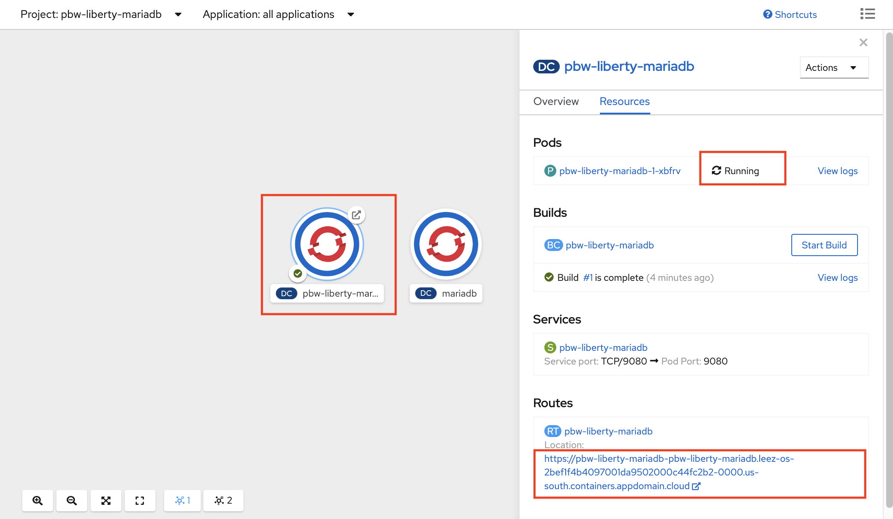

# IBM Client Developer Advocacy App Modernization Series

## Lab - Deploy "Plants by WebSphere Java application" to OpenShift


## Overview

S2I in a tool deployed in OpenShift that provides a repeatable method to generate application images from source/binary code Templates provide a parameterized set of objects that can be processed by OpenShift. Templates provide a parameterized set of objects that can be processed by OpenShift.

In this lab you'll use these  capabilities can be used to deploy a small legacy  Java EE app to OpenShift on the IBM Cloud Kubernetes Service.

### Step 1: Logon into the OpenShift Web Console and to the OpenShift CLI

1.1 Go to your IBM Cloud resource list https://cloud.ibm.com/resources

1.2 Click on  your designated OpenShift cluster

   

1.3 Click on **OpenShift web console**

   

1.4 From the OpenShift web console click on your username in the upper right and select **Copy Login Command**

   

1.5 Click `Display Token` link.

1.6 Copy the login command in the `Log in with this token` field.

1.7 Paste the login command in a terminal window and run it (Note: leave the web console browser tab open as you'll need it later on in the lab)

### Step 2: Clone the WebSphere Liberty S2I image source, create a Docker image,  and push it to the OpenShift internal registry

2.1 Clone the  the WebSphere Liberty S2I image source by issuing the following commands in the terminal window you just used to login via the CLI

   ```bash
   git clone https://github.com/IBMAppModernization/s2i-liberty-javaee7.git
   cd s2i-liberty-javaee7
   ```

2.2 In order to deploy to OpenShift, you need to push container images to your cluster's internal registry. First, run the following commands to authenticate with your OpenShift image registry.

   ```bash
   oc patch configs.imageregistry.operator.openshift.io/cluster --patch '{"spec":{"defaultRoute":true}}' --type=merge

   export INTERNAL_REG_HOST=$(oc get route default-route -n openshift-image-registry --template='{{ .spec.host }}')
   echo $INTERNAL_REG_HOST
   ```
2.3 Create a new OpenShift project for this lab

   ```bash
   oc new-project pbw-liberty-mariadb
   ```

2.4 Build the S2I Liberty image and tag it appropriately for the internal registry

   ```bash
   docker build -t $INTERNAL_REG_HOST/`oc project -q`/s2i-liberty-javaee7:1.0 .
   ```

2.5 Login to the internal registry

   ```bash
   docker login -u `oc whoami` -p `oc whoami -t` $INTERNAL_REG_HOST
   ```
2.6 Push the S2I Liberty image to the internal registry

   ```bash
    docker push $INTERNAL_REG_HOST/`oc project -q`/s2i-liberty-javaee7:1.0
   ```

### Step 3: Install MariaDB from the OpenShift template catalog

3.1 In your OpenShift Web console, switch to `Developer` view.

   

3.2 From the `Project` dropdown list, select **pbw-liberty-mariadb** project.

   

3.3 Click on **From Catalog** tile.

3.4 Under `All IItems`, select the **Databases** category, then choose **MariaDB**.

3.5 Select **MariaDB (Ephemeral)** tile on the right.

   

3.6 Click **Instantiate Template**.

3.7 Enter the following values for the fields indicated below (leave remaining values at their default values)

| Field name | Value |
| ---------- | ----- |
| MariaDB Connection Username | `pbwadmin` |
| MariaDB Connection Password | `l1bertyR0cks` |
| MariaDB Database Name | `plantsdb`|

When you're done the dialog should look like the following:

 

3.8 Scroll down and click **Create**.

3.9 From the `Actions` dropdown mnenu, select the **Edit Labels**.

 

3.10 Enter `app=pbw-liberty-mariadb` in field `Labels for TI mariadb-ephemeral-vbfhz`.

3.11 `Save`.

3.12 It may take couple of minutes for the new database instance to be ready. Verify the status of MariaDB instance before moving on to the next step.

   

### Step 4: Clone the Github repo that contains the code for the Plants by WebSphere app

4.1  Login in [your Github account](https://github.com)

4.2  In the search bar at the top left, type in `app-modernization-plants-by-websphere-jee6`

 

4.3  Select the repository `IBMAppModernization/app-modernization-plants-by-websphere-jee6` and then click on the **Fork** icon

4.4  Click the **Clone or download** button from your copy of the forked repo and copy the HTTPS URL to your clipboard

 

4.5 From your terminal go back to your home directory

  ```text
  cd ~
  ```
4.6  From the client terminal window clone the Git repo  with  the following commands  appending the HTTPS URL from your clipboard

  ```text
  git clone [HTTPS URL for NEW REPO]
  cd app-modernization-plants-by-websphere-jee6
  ```

### Step 5: Install the Plants by WebSphere Liberty app using a template that utilizes S2I to build the app image   

5.1 Add the Plants by WebSphere Liberty app template to your OpenShift cluster in the terminal window.

   ```bash
   oc create -f openshift/templates/s2i/pbw-liberty-template.yaml
   ```
5.2 In your OpenShift coonsole, make sure you're in the **pbw-liberty-mariadb** project.

   

5.3 Select `Topology` in the left pane to view your MariaDB instance.

5.4 Select **+Add** in the left pane.

5.5 Select `From Catalog` tile.

5.6 Select the **Other** category under `All Items` and then select **Plants by WebSphere on Liberty**.

   

5.7 Select `Instantiate Template`.

5.8 Accept all the default values and click **Create**

5.9 Wait until the instance of the Plants by WebSphere app on Liberty shows as `Ready` status.

5.9 Select `Topology` in the left pane.

5.10 Select `pbw-liberty-mariadb` icon in the right pane.

   

5.11 It should be in `Running` status.

5.12 Click the `Route` link to access the application.

> Note: The application may not be ready for you to access even deployment has been completed. It may take another couple of minutes when you are able to access it.


### Step 6: Test the Plants by WebSphere app

6.1 From the Plants by WebSphere app UI, click on the **HELP** link

   

6.2 Click on **Reset database** to populate the MariaDB database with data

6.3 Verify that browsing different sections of the online catalog shows product descriptions and images.

   

## Summary

With even small simple apps requiring multiple OpenShift  objects,  templates  greatly simplify the process of distributing OpenShift  apps. S2I allows you to reuse the  same builder image for apps on the same app server, avoiding  the effort of having to create unique images for each app.
